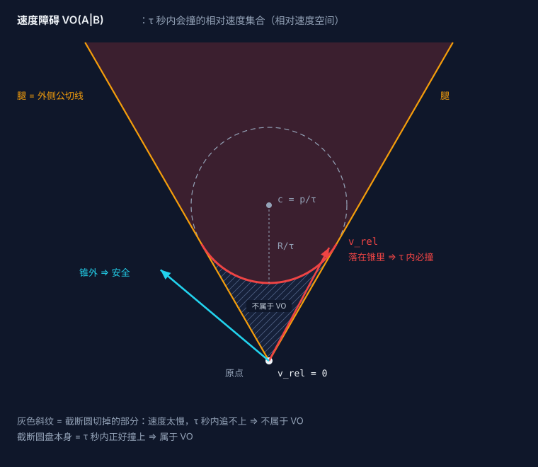
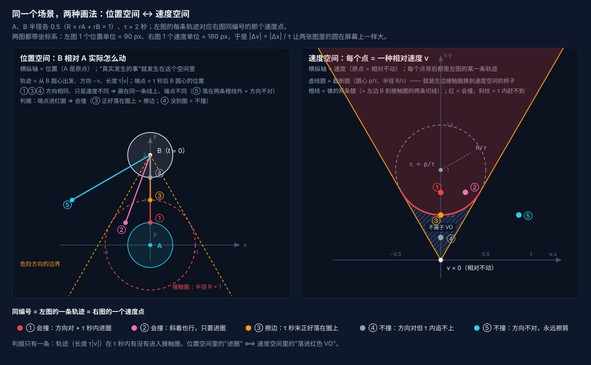
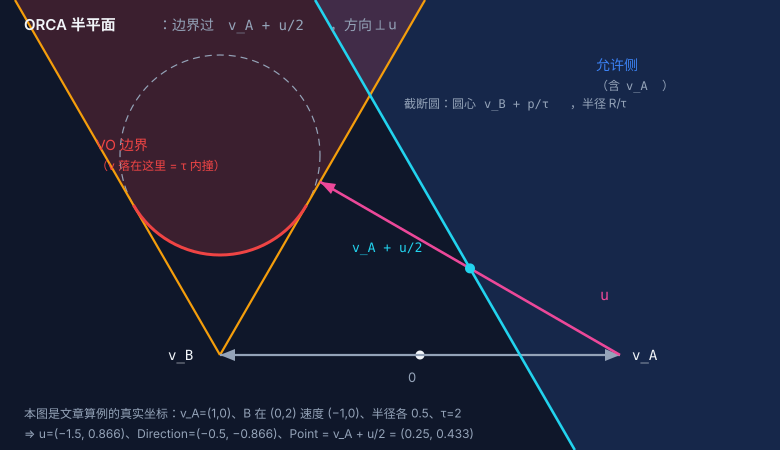
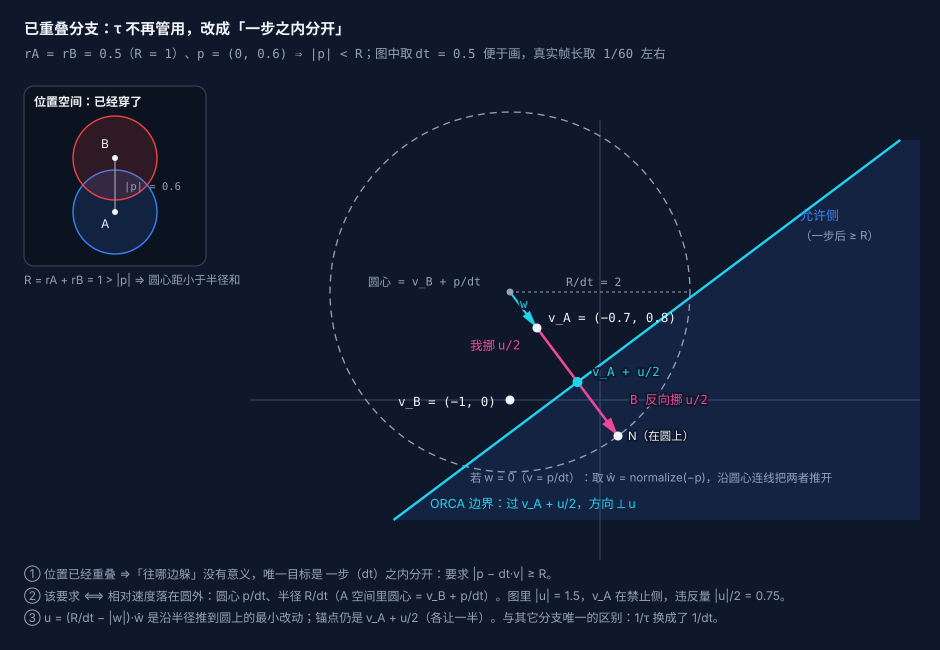
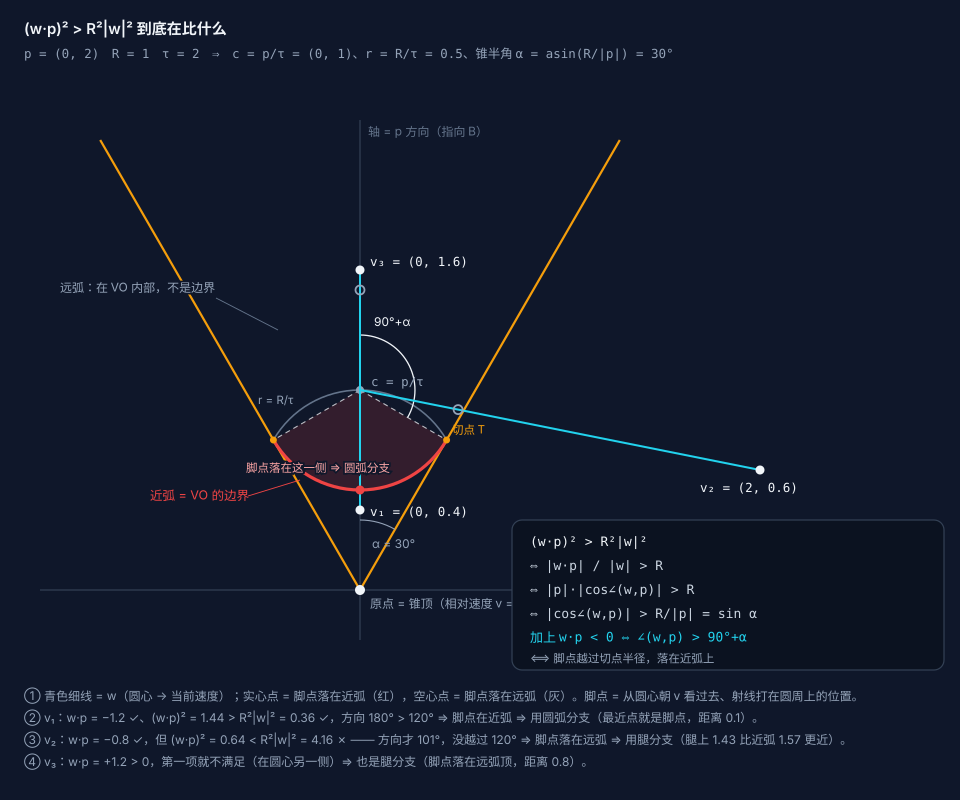
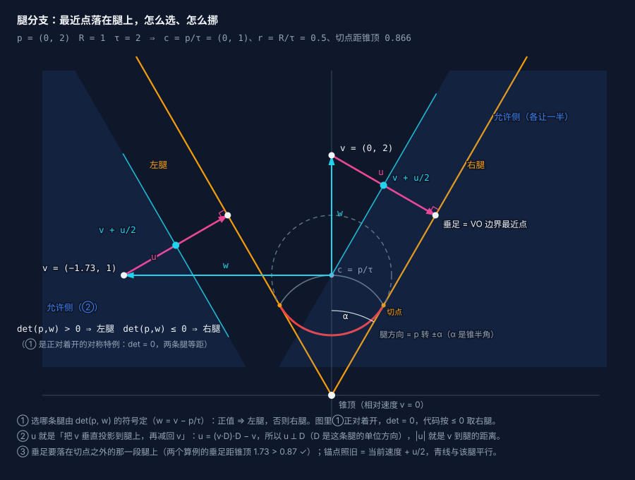

## 速览

>- **一句话**：每个 agent 只决定自己"这一帧用什么速度"，位置由速度积分出来；避障的全部数学都在"速度"这个平面里完成。
>- **速度障碍 VO**：把邻居 B 当成半径 `rA + rB` 的圆，再把"我相对它的速度"看成一个点。**落在圆锥里 = τ 秒内会撞**。
>- **RVO / ORCA**：VO 要求"我一个人躲开"，RVO 改成"双方各让一半" —— 相对速度的最小改动 `u` 两人平摊；ORCA 再从"VO 边界最近点"取一条**切线**，把锚点放在 `u` 的中点（`vA + u/2`），于是每个邻居压成一条**半平面**：凸约束，才可以用线性规划求解。
>- **两个坐标系别搞混**：VO 画在相对速度空间（锥顶在原点），半平面必须画在 A 自己的速度空间（锥顶在 `vB`）；`u` 是差向量、两边通用，只有锚点会平移。
>- **求解**：每个邻居（和每段障碍物）贡献一条半平面，解 = 在「半径 = 最大速度的圆 ∩ 所有半平面」里，**离期望速度最近的那个点**。三层线性规划（LP2 顺序贪心 / LP1 沿边界滑动 / LP3 最小违反量）就是干这件事。
>- **静态障碍物必须带拓扑**：只给一堆孤立线段，腿的方向会指进相邻边、约束方向就错了。每条边都要知道自己的前一条边、后一条边和凸性。

---

## 0. 先明确"输入输出"

避障算法听起来玄，但它的接口其实非常小：

```
输入：我的位置 pA、半径 rA、最大速度 maxSpeed、期望速度 prefVelocity
      每个邻居的位置 pB、速度 vB、半径 rB
输出：一个新的速度 velocity（长度不超过 maxSpeed）
```

也就是说：**算法不管路径规划，只管"这一刻该用什么速度"**。位置由调用方每帧做一次积分：

```csharp
position += velocity * deltaTime;
```

为什么这样设计？因为"绕开别人"这件事天然是**动态**的——邻居也在动，任何提前算好的路径都会过期。把决策压到"每帧重选一次速度"，问题就变成一个**几何问题**，而且每帧只需算一次。

要让这件事成立，所有 agent 必须遵守同一个约定：**每个人都愿意为别人改变自己的速度，且改变量可以由一个双方都算得出来的规则确定**。这就是后面"互惠（reciprocal）"的含义。

---

## 1. 速度障碍 VO：把"会不会撞"变成平面几何

### 1.1 第一步：两个圆 → 一个圆

两个圆不相交的条件是"圆心距 ≥ 半径和"。所以把 A 看成点、把 B 膨胀成半径 `R = rA + rB` 的圆，判定就只剩一次距离比较：

```
原本：|pB − pA| < rA + rB  ⇒ 相撞
等价：把 B 膨胀成半径 R = rA + rB 的圆，A 缩成一个点 ⇒ 点在圆内即相撞
```

这一步的意义是：**把"两个都在动的物体"变成"一个点在动的圆旁边"**。

### 1.2 第二步：只看相对运动，并给定一个时间视野 τ

接下来引入 **时间视野 τ**（time horizon）：我们只关心"τ 秒之内会不会撞"，τ 之外的事不管（后面会看到 τ 怎么影响手感）。

在时间 τ 内，B 相对 A 的位移由**相对速度**决定。记

- 相对位置 `p = pB − pA`
- 相对速度 `v = vA − vB`

（注意 `det(a, b) = a.x·b.y − a.y·b.x`，下同。这个"二维叉积"在本文里到处用来判左右和符号。）

B 相对 A 的位置随时间变化为 `p(t) = p − t·v`。于是：

> **会撞** ⟺ 存在 `t ∈ (0, τ]`，使得 `|p − t·v| < R`

（后文的图与算例统一用这组具体数字：`|p| = d = 2`、`R = rA + rB = 1`、`τ = 2`；各图之间只有**当前速度 `vA` / 邻居速度 `vB` 的取值不同**，VO 的形状完全一样。另外本文按通用二维平面写成 x-y —— 在 Unity 里这块平面通常是 x-z，把下文所有轴名换成 x-z 同样成立。）

### 1.3 第三步：把 v 看成平面上的一个点

关键观念转变：**不要把 v 当成"速度"，把它当成二维平面上的一个坐标点**（横轴 = v.x，纵轴 = v.y）。这样"哪些 v 会导致相撞"就是平面上的一块区域。

把 `|p − t·v| < R` 里的 `t` 消掉：在 `t = τ` 这一刻，条件变成 `|p − τ·v| < R`，也就是

```
|v − p/τ| < R/τ
```

**这是一条圆的信息**：圆心在 `p/τ`、半径 `R/τ`。它的含义是：**"τ 秒后正好撞上"的速度集合**。

但"会撞"不只发生在第 τ 秒。把 τ 秒内的所有时刻一起考虑，得到的区域是：

- 从原点（v = 0）出发，作两条过这个圆的切线（图中橙色"腿"）；
- 圆锥内部就是"方向不对、迟早撞上"；
- 靠近原点的一小块要**切掉**（图中**灰色斜纹**那块）——速度太慢，τ 秒内根本追不上；
- 圆盘本身（含圆内）属于"τ 秒内正好撞上"，是危险的。

这块红色区域就是 **速度障碍 VO（Velocity Obstacle）**：它的内边界是截断圆**面向原点的那一段弧**（近弧），而不是整条直线。



> 直观记忆法：**锥体回答"方向对不对"，截断圆回答"快不快"**。方向错了必撞；方向对但太慢就不会在 τ 内撞。

<!--
**从"位置图"到"速度图"，中间只隔一步代数。** 上面这个圆和那两条腿都不是拍脑袋画的，它们在位置空间里都有出处：

```
|p − τ·v| ≤ R          ← 位置空间：τ 秒后 B 的位置落进「接触圈」
⟺ |v − p/τ| ≤ R/τ      ← 速度空间：v 落进「截断圆」
```

| 位置空间（左图） | ↔ | 速度空间（右图） |
|---|---|---|
| 接触圈：圆心 A、半径 `R` | ↔ | 截断圆：圆心 `p/τ`、半径 `R/τ` |
| 从 B 到接触圈的两条**切线** | ↔ | 锥的两条**腿** |
| 轨迹长度 `τ·|v|`（多久能到） | ↔ | 离原点多远（速度多大） |

同一个不等式换个坐标系看就是两张图 —— 左边是一条轨迹、右边是一个点，同编号一一对应：


-->
---

## 2. 从 VO 到 RVO：为什么必须"各让一半"

VO 的判定有个致命问题：它假设**邻居不会躲**。

用 VO 的话，A 认为"只要 v 落进锥里就不行"，于是 A 会拼命让开；而 B 用同样的规则也会拼命让开。两个人都让，结果反复过冲、来回抖动；更糟的是**对称情形会死锁**（两边都让到极限，谁也过不去）。

**RVO（Reciprocal Velocity Obstacle）** 的改法非常朴素：

> 假设"对方也会承担一半责任"，所以我只需要负责另一半。

先把"要挪多少"定义清楚。VO 画在**相对速度空间**里（原点 = `v = vA − vB = 0`），当前速度就是那个点 `v`。把它挪到 VO 边界上所需的**最小改动**记作 `u`：

```
u = (VO 边界上离 v 最近的点) − v        ← 挪这么多就刚好擦边
```

`u` 一定**垂直于该点处的边界**（不垂直就说明还能沿边界滑一下、挪得更少，与"最近"矛盾）。**VO 语义**是让 A 一个人挪掉整个 `u`（因为假设 B 不动），也就是"边界过 `v + u`"。

RVO 说：这活儿两人平摊。A 挪 `u/2`，B 从自己的视角反向挪 `u/2`，那么**相对速度**的变化是

```
(vA + u/2) − (vB − u/2) = (vA − vB) + u = v + u      ← 正好落在 VO 边界上
```

所以"各让一半"在几何上只有一句话：**边界从 `v + u` 挪到 `v + u/2`**（在 A 自己的速度空间里写成 `vA + u/2`，见 §3.1）。它带来两个好处：

1. **对称情形不再死锁**：两边各让一半，正好错开；
2. **无需通信**：只要双方用同一套规则和同一份邻居数据，各自算出的"一半"是自洽的。

---

## 3. 从 RVO 到 ORCA：半平面是怎么来的

RVO 已经把问题从"圆锥"缩小到了"边界"，但边界仍然是**弯的**（一条腿 + 一段圆弧）。弯曲的约束不好求解。ORCA 的一步就是：

> 在最近点处**取切线**，把弯边界换成一条直线（半平面）。

下面是这条半平面的完整来历：五步，每一步都能在那张图上直接指出来。

### 3.1 第 0 步：约束必须写在"A 自己的速度空间"里

这是最容易绕晕、也是**两张图看着不一样**的原因。A 唯一能决定的是 `vA` 本身，所以半平面必须以 `vA` 为坐标来写；而 §1 的 VO 是画在**相对速度空间**里的。两个空间只差一次平移 `vB`：

| | 相对速度空间（`orca-vo-cone.svg`） | A 自己的速度空间（`orca-halfplane.svg`） |
|---|---|---|
| 原点 | `v = 0` | `vA = 0`（图上标 `0` 的那个点） |
| 锥顶 | 原点 | `vB` |
| 截断圆圆心 | `p/τ` | `vB + p/τ` |
| 当前速度点 | `v` | `vA` |

**关键一点**：`u` 是**差向量**，两个空间里数值完全一样（`v` 与 `vA` 只差常数 `vB`，相减就抵消了）。所以"最近点在哪个方向、要挪多少"**不用重算**，平移的只是锚点：

| 这条线说什么 | 相对速度空间 | A 自己的速度空间 |
|---|---|---|
| VO 边界（"只我负责"的极限） | 过 `v + u` | 过 `vA + u` |
| **RVO/ORCA 边界（"各让一半"）** | 过 `v + u/2` | 过 **`vA + u/2`** |

§2 里说的"边界过 `v + u/2`"和 §4.4 代码里的 `line.Point = self.Velocity + 0.5f * u` **是同一条线**，只是分别在两个坐标系里写。后文统一用 A 空间。

### 3.2 第 1 步：先找 `u`（最小改动）

```
u = (VO 边界上离当前速度最近的点) − (当前速度)
```

§4 的三个分支只是在问"最近点落在边界的哪一段"：已经重叠、落在近弧上、落在某条腿上。不管哪个分支，`u` 都满足两条性质：

- 长度 = 当前速度到 VO 边界的距离 ⇒ 这是**最小**改动；
- `u` ⟂ 边界在最近点处的切线。

### 3.3 第 2 步：用切线代替弯边界

在最近点 `N = 当前速度 + u` 处取切线，得到一条直线；**允许侧取"背向 VO"的那一侧**（正常巡航时，当前速度就在这一侧）。这一步把弯曲的锥/弧"拍平"成一条直线约束 —— 代价是约束变粗，换来的是线性。

注意这条切线本身就是**"只我负责"（VO 语义）的边界**：本来安全时，我最多可以朝危险方向吃掉整段余量 `|u|`；已经要撞时，则必须把整段 `|u|` 让出来。

### 3.4 第 3 步：把锚点放到 `u` 的中点 —— 这才叫 ORCA

既然责任平摊，余量也该平摊：把上面那条切线**朝当前速度平移 `|u|/2`**，让它过 `当前速度 + u/2`。这就是 **ORCA 半平面**。

```
允许的一侧：det(Direction, X − (vA + u/2)) ≥ 0，  Direction 是单位切向、且 Direction ⟂ u
```

同一个"中点"有两种读法，都对：

- **已经踩进 VO**（当前速度在危险里）：线只要求我让出 `|u|/2`，剩下的 `|u|/2` 记在对方账上；
- **本来安全**（当前速度在 VO 外）：线不许我朝危险方向吃掉超过一半的余量，另一半留给对方的反应。

> 下面那张图画的是**第一种**（当前速度已经在 VO 里、"不处理就撞"的那种帧）—— 因为只有这一种才看得出这条线为什么必要。第二种在 §4.4 的符号判据里一起说。

再补一个符号检查 —— `vA` 落在允许侧还是禁止侧？把 `X = vA` 代进去：

```
det(D, vA − (vA + u/2)) = −½·det(D, u)，  而 |det(D, u)| = |u|   （D 是单位向量且 ⟂ u）
```

也就是说，**当前速度到这条边的垂直距离恒为 `|u|/2`**；它在哪一侧，正好对应"当前相对速度有没有踩进 VO"：

| 当前状态 | `det(D, vA − Point)` | 含义 |
|---|---|---|
| 没踩进 VO | `> 0`（在允许侧） | 当前速度合法，手里还攥着 `|u|/2` 的余量 |
| 已踩进 VO | `< 0`（在禁止侧） | 违反量恰好 `|u|/2`，LP 至少把它推回边界上 |

这张表顺便回答了"半平面会不会一上来就把 agent 判成无解"：**正常巡航时，当前速度一定在自己所有半平面的允许侧上**（因为那时相对速度不在任何 VO 里）。

### 3.5 第 4 步：一堆半平面 = 凸可行域 = 线性规划

于是每个邻居贡献一条半平面，整个问题变成：

```
在「以原点为圆心、maxSpeed 为半径的圆」里，
找一个点，它落在所有半平面允许的一侧，且离期望速度最近。
```

**为什么非要半平面？** 因为半平面是凸的，一堆半平面的交集也是凸的（交集就是"可行域"）。凸集上找一个离给定点最近的点，是有稳定、快速、且**一定能解**的算法（线性规划）。而"圆 ∩ 一堆圆锥"这种非凸约束，就只能靠搜索或迭代近似。

一个 ORCA 半平面的完整信息就是两个量：

```csharp
struct HalfPlane {
    public float2 Point;      // 边界上的一点 = vA + u/2
    public float2 Direction;  // 边界的单位切向，⟂ u（具体朝向由分支公式 + 下面的取向约定定）
}

```

> **让危险（VO）落在Direction向量的左侧**，那么有**允许的一侧**的公式为： `det(Direction, X − Point) >= 0`
>
> 因为`det(D, w) = D.x·w.y − D.y·w.x = |w|·sin∠(D, w)` 就表示`w` 在 `D` 的哪一侧、离线多远的**有符号垂直距离**
>
> 正 = 沿 `D` 走时的左手边，负 = 右手边，0 = 正好落在线上
>
> 于是 `det(D, X − Point) ≥ 0`   ⟺   X 落在「过 Point、方向 D」这条直线的左侧（含线上）


`Point` 只决定这条线**画在哪**（平移），`D` 同时决定它的**朝向**和"哪边算正"。



> **怎么读这张图**（按顺序看；这是一帧"已经要撞"的情形）：
>
> 1. **先确认它真的要撞**：`vA` 落在红色 VO 里 —— 相对速度 `v = (0,2)` 是正对着开，1 秒后两者中心重合。所以这里"不处理"不是没事，是**必撞**。
> 2. **约束画在 A 自己的速度空间里**：锥顶在 `vB`（不是原点）、截断圆圆心在 `vB + p/τ`（相对空间的 VO 整体平移了一个 `vB`）；`u` 是差向量，两个空间通用。
> 3. **要挪多少**：粉箭 `u` = 从 `vA` 到 VO 边界最近点 `N` 的最小改动（这里 `|u| = 1`）。只我负责时，得把速度挪到橙色腿上，也就是整段 `u`。
> 4. **各让一半**：青色 ORCA 边界从 `u` 的中点穿过（`vA + u/2`）、方向 ⟂ `u`；我挪 `u/2`、B 反向镜像挪 `u/2`，相加正好是 `u` ⇒ 相对速度落到 VO 边界上。
> 5. **`vA` 在哪一侧**：`det(D, u) = +1 > 0` ⇒ 它在**禁止侧**，违反量恰好 `|u|/2 = 0.5`，所以 LP 必须把速度推过青线。紫色斜纹那一条（宽度同样是 `|u|/2`）就是允许侧切进 VO 的那部分 —— 那不是"允许撞"，而是"**对方会让掉的那一半**"。
>
> 橙色腿是"只我负责"的边界，青线是它朝 `vA` 平移 `|u|/2` 之后的结果。**从腿到青线的那半个 `u`，就是"互惠"的全部几何内容。**

---

## 4. 构造半平面：三个分支，逐个手算

对每个邻居，都要从"当前位置 + 速度"推出一条半平面。记：

```
p  = pB − pA        // 相对位置
v  = vA − vB        // 相对速度（这个 v 才会落进 VO）
vA                  // A 自己的速度 —— 半平面最终要约束的决策变量
vB                  // 邻居的速度
R  = rA + rB        // 合并半径
w  = v − p/τ        // 从"截断圆圆心"指向"当前相对速度"的向量
```

两个提醒（§3.1 的延续，全文最容易搞混的地方）：

- `v`、`w`、`u` 都是**差向量**，在相对速度空间和 A 的速度空间里数值一样；**只有"锚点"会随坐标系平移**：`line.Point = vA + u/2`（不是 `v + u/2`，也不是 `vA + u`）。
- 代码里 `v`（`relativeVelocity`）只用来算 `w`、判断分支和算 `u`；到了写 `line.Point` 那一步，用的是 `vA`（`self.Velocity`）。

```csharp
// RVO2 的口径：relV 是相对速度，line.Point 挂在 A 自己的速度上
var relV = self.Velocity - other.Velocity;
...
line.Point = self.Velocity + 0.5f * u;    // = vA + u/2（不是 relV + u/2）
```

最后一个量 `w` 是全文的关键：**它的起点是圆心 `p/τ`，终点是当前速度点**。所有"离圆多远""投影到哪"的判断都可以用 `w` 表示。

### 4.1 分支一：已经重叠（`|p| ≤ R`）

两个圆已经穿了。这时"方向"已经没有意义（不存在"不撞的方向"），只能**尽快分开** —— 判据也不再是"τ 秒内会不会撞"，而是"**一步之内能不能分开**"：

几何上和 §1.3 的 VO 是同一套写法，只是把 `τ` 换成了 `dt`：要求

```
|p − dt·v| ≥ R   ⟺   |v − p/dt| ≥ R/dt
```

也就是**相对速度必须落在圆外** —— 圆心 `p/dt`、半径 `R/dt`（在 A 自己的速度空间里，圆心是 `v_B + p/dt`）。这个圆可以叫"**一步分开圆**"：落在圆内，就意味着一个 `dt` 之后两者还挤在一起。

于是 `u = (R/dt − |w|)·ŵ` 的含义很直白：`w = v − p/dt` 是从圆心指向当前相对速度的向量，`R/dt − |w|` 是"离圆边界还差多少"，乘上单位方向 `ŵ` 正好是**沿半径推到圆上的最小改动**。写半平面时照旧锚在 `v_A + u/2`：`v_A` 落在禁止侧（`det(D,u) = +|u|`）、违反量 `|u|/2`；B 反向镜像挪 `u/2`，两者相加正好是 `u`，于是一步之后恰好 `|p′| = R`（分开到"刚好不重叠"）。



上图中间那条深色细线就是从圆心出发的 `w`、接着它延长出去的是 `u` —— 两者共线（都沿半径），中间那个青点就是锚点 `v_A + u/2`。


```
w = v − p/dt            // 注意这里是 1/dt，不是 1/τ：立刻要分开
D = (ŵ.y, −ŵ.x)         // 与 w 垂直
u = (R/dt − |w|)·ŵ      // 沿"离开圆心"的方向把速度推出去
```

`D` 之所以取"把 `ŵ` 转 90°"，是为了让允许侧落在 `u` 那一侧：这一分支里 `u` 指向"把相对速度推离那个圆、尽快分开"的方向，于是约束会把速度朝**分开**的方向推出去（`D` 的取向约定见 §3.5，符号判据见 §4.4）。

> 退化情形：当 `v` 恰好等于 `p/dt` 时 `w = 0`，`ŵ` 没有定义。此时退化成**沿圆心连线、朝"把两者推开"的方向**兜底：`ŵ = normalize(−p)`（`p` 是"A 指向 B"，所以要取反向；DotS 实现里还额外兜了一层 `distSq` 也为 0 的情形，直接取 `(1,0)`）。数值上永远不要对零向量做归一化。


### 4.2 分支二：未重叠，最近点在截断圆弧上

判定条件：

```
w · p < 0  且  (w · p)² > R² · |w|²
```

这两个条件合起来只回答一个问题：**从截断圆圆心 `c = p/τ` 朝当前速度点 `v` 看过去，这条射线打在圆周的哪一段上**。打在**近弧**（面向锥顶的那一段）上 ⇒ 那个脚点就是 VO 边界上离 `v` 最近的点，走圆弧分支；打在**远弧**上（远弧在 VO *内部*，根本不是边界）或者射线方向还没背离锥顶 ⇒ 最近点其实在**腿上**，走腿分支。

<!--
把第二项化成角度，就看清它在比什么了：

```
(w·p)² > R²|w|²
 ⟺ |w·p| / |w| > R
 ⟺ |p|·|cos∠(w,p)| > R
 ⟺ |cos∠(w,p)| > R/|p| = sin α        （α 是锥半角：sin α = R/|p|）
 ⟺ ∠(w,p) 与 90° 相差超过 α
再配上第一项 w·p < 0（方向已在背向锥顶的半边）：
 ⟺ ∠(w,p) > 90° + α
```

`90° + α` 不是凑出来的：**它正是"从圆心指向切点的半径"与轴的夹角**。看直角三角形「原点–圆心–切点 `T`」——`T` 处是直角、锥顶处是 `α`，所以圆心处是 `90° − α`；把这条半径换算成"与轴正向 `p` 的夹角"就取补角，得 `90° + α`。于是：

- `∠(w,p) > 90° + α` ⇒ 射线落在**近弧张成的扇区**里 ⇒ 脚点在近弧上 ⇒ 用圆弧分支；
- 否则 ⇒ 脚点落在**远弧**上（不在边界上）⇒ 最近点在腿上 ⇒ 用腿分支。

> ⚠️ **别把第二项读成"横向偏移有没有超过半径"**（本文早前的版本就是这么写的，不准确）：它比的是 `|p|·|cos∠(w,p)|` 与 `R`，换成人话是"**从圆心看过去，方向越过切点没有**"，跟"横向距离"不是一回事 —— 正对着开（`v` 在轴上、横向偏移为 0）反而满足它。
-->


> 图里三个例子（`p = (0,2)`、`R = 1`、`τ = 2` ⇒ `c = (0,1)`、`r = R/τ = 0.5`、锥半角 `α = 30°`，所以阈值 `90° + α = 120°`）：
>
> - `v₁ = (0, 0.4)`：`w·p = −1.2 < 0` ✓、`(w·p)² = 1.44 > R²|w|² = 0.36` ✓ ⇒ 方向 180° > 120° ⇒ 脚点（红实心点）落在**近弧** ⇒ 圆弧分支（最近点就是脚点，距离 0.1）；
> - `v₂ = (2, 0.6)`：`w·p = −0.8 < 0` ✓，但 `(w·p)² = 0.64 < R²|w|² = 4.16` ✗ ⇒ 方向只有 101°，没越过 120° ⇒ 脚点（灰空心点）落在**远弧** ⇒ 腿分支（腿上 1.43，比近弧的 1.57 更近）；
> - `v₃ = (0, 1.6)`：`w·p = 1.2 > 0` ✗（在圆心另一侧，第一项就不满足）⇒ 同样是腿分支。

此时把速度**沿 `w` 方向推到圆上**：

```
ŵ = normalize(w)
D = (ŵ.y, −ŵ.x)
u = (R/τ − |w|)·ŵ
```

`R/τ − |w|` 就是"离圆边界还差多少"，单位是速度，乘上方向 `ŵ` 正好是"推到圆上"所需的最小改动。

### 4.3 分支三：未重叠，最近点在腿上（可手算）

不满足上面条件时，最近点落在两条腿之一。用 `det(p, w)` 的符号判左右：

```               
若 det(p, w) > 0  → 左腿
若 det(p, w) ≤ 0  → 右腿
```

> 直觉：`det(p,w) = |p|·|w|·sin∠(w,p)`，所以 `det(p,w) > 0` 就是"`w` 在 `p` 的逆时针一侧"（当前速度点偏左）⇒ 离它最近的是**左腿**。

判完腿之后求 `u`：这一分支是**纯投影** —— 把 `v` 垂直投影到那条腿所在的直线上，再减回 `v`（代码里写成 `u = (v·D)·D − v`，`D` 是这条腿的单位方向）。它和 §4.2 是同一个思路（"取到边界的最小改动"），只是这里的边界是直线，所以最小改动必然**垂直于这条边界**。



图上给了两个算例：① **正对着开**（`v = (0, 2)`，`det(p,w) = 0`，两条腿等距，代码按 `≤ 0` 取右腿）—— 就是下面手算的这一组；② **擦身而过**（`v = (−√3, 1)`，`det(p,w) = 2√3 > 0` ⇒ 左腿）。两者的 `u` 都是"`v` 到那条腿的垂线"：`u ⟂ D`，`|u|` 正好是 `v` 到腿的距离；而且垂足必须落在**切点之外**的那一段腿上（图里两个垂足距锥顶都是 `√3 ≈ 1.732 > 0.866`），否则最近点会退回近弧或者切点。

`D` 就是这两条腿的单位方向 —— 把 `p` 旋转锥半角 `±α`（`sin α = R/|p|`、`cos α = leg/|p|`）；公式里用 `leg`、`R` 顶替 `sin/cos`，所以看不到三角函数：

```
leg = sqrt(|p|² − R²) // 切线长：位置空间里 A 到「半径 R 的接触圆」的切线
sin α = R / |p|        
cos α = leg / |p|

D_l = ( p.x·cos α − p.y·sin α,  p.x·sin α + p.y·cos α ) / |p|
    = ( p.x·leg − p.y·R,  p.x·R + p.y·leg ) / |p|²     // 左腿 D：把 p 逆时针转 α 再归一化（沿左腿「朝外」，背离原点）
D_r = −( p.x·cos α + p.y·sin α, −p.x·sin α + p.y·cos α ) / |p|  
    = −( p.x·leg + p.y·R, −p.x·R + p.y·leg ) / |p|²     // 右腿 D：把 p 顺时针转 α 之后「再取反向」（沿右腿「朝内」，指向原点）

u   = ( v · D ) · D − v
```

> ⚠️ **右腿那个负号不能省**：要求"锥内 ⟺ `det(D, X) < 0`"（两条腿都满足 `det(D, p) = −R < 0`）。省掉负号，右腿的 `D` 就取成了反方向，`det(D, X − Point) ≥ 0` 的允许侧会翻进锥里 —— 把"正在撞"的速度当成合法。

### 4.4 收尾：把三个分支统一写成一条半平面

三个分支算出 `u` 与 `D` 之后，收尾只剩两行（RVO2 原版逐字如此）：

```csharp
// 锚点落在「当前速度 + u/2」上：各担一半责任
line.Point     = self.Velocity + 0.5f * u;    // = vA + u/2（注意不是 vA + u）
line.Direction = D;                           // 单位切向，且 D ⟂ u
```

> `u = 0`（当前速度正好落在边界上）也不用特判：此时 `Point = vA`，约束退化成"不许越过这条切线"，正是想要的结果；真正危险的零向量（`w = 0`）在 4.1 那个分支里已经兜住了。

**`det(D, X − Point) ≥ 0` 的几何含义与"`D` 的取向约定"在 §3.5 已经讲完**（一句话：`D` 的朝向让 VO 落在负侧，所以允许侧就是 `det ≥ 0` 那一侧）。这里只剩下**这一分支自己的**算式。代入 `X = vA`、`Point = vA + u/2`：

```
det(D, vA − Point) = det(D, −u/2) = −½·det(D, u)，   而 |det(D, u)| = |D|·|u|·sin 90° = |u|
```

所以这个值**恒为 `±|u|/2`** —— 当前速度到这条边的垂直距离永远是 `|u|/2`。其实不算也知道：`Point` 是 `vA` 到边界点 `N` 的**中点**，而这条线 ⟂ `u`，于是线段 `vA → N` 被它**垂直平分**，两头各 `|u|/2`。

有信息量的是**符号**：

- **`det(D, u) < 0` ⇒ 值 `= +|u|/2 > 0`**：`vA` 在允许侧 —— 这一帧本来安全，约束是"满足"的，但它只留了 `|u|/2` 的余量（"只准我吃一半"）；
- **`det(D, u) > 0` ⇒ 值 `= −|u|/2 < 0`**：`vA` 在禁止侧 —— 这一帧已经踩进 VO，**违反量恰好是 `|u|/2`**，LP 至少要把速度推过这条线这么多，另一半记在对方账上。

同一组数（`p = (0,2)`、`R = 1`、`τ = 2`、`|u| = 1`）能同时看到两个符号：安全速度（§4.3 图里算例②）`det(D,u) = −1` ⇒ 值 `+0.5`；正对着开（算例①）`det(D,u) = +1` ⇒ 值 `−0.5`。**同一个 `|u|/2`，符号回答"现在安不安全"。**

这也直接对上 LP 的代码：§5.3 判"违反第 i 条"用的是 `det(D, Point − X) > 0`，也就是 `det(D, X − Point) < 0` —— 正好是禁止侧的判定。

---

## 5. 三层线性规划：把一堆半平面解成一个速度

### 5.1 问题定义

```
可行域 = { X : |X| ≤ maxSpeed 且 对所有 i, det(D_i, X − P_i) ≥ 0 }
目标   = argmin |X − optimum|,  其中 optimum = ClampLength(prefVelocity, maxSpeed)
```

`optimum` 是"如果没有邻居，我最想用的速度"（期望速度截到最大速度以内）。注意我们要最小化的是**速度空间里的距离**，不是路径长度。

### 5.2 朴素做法为什么不行

最天真的想法是"把所有不等式一起丢给一个通用 LP 求解器"。放在游戏循环里，它有三个对不上的地方：

1. **问题形状不是 LP**：目标函数是二次的（离期望速度最近），约束里还有一个圆（`|X| ≤ maxSpeed`）。通用 LP 表达不了它 —— 要么换成 QP，要么把圆离散成一堆切线；前者是另一套重型机器，后者直接牺牲精度。
2. **规模和调用频率不匹配**：这里只有 **2 个变量、最多 31 条约束**，却要**每个 agent 每帧算一次**。通用求解器为"任意规模、任意形式"付出的固定开销，在这个频率下全是浪费；而下面的特化算法常见情况下只是"每条约束一次 `det`"。
3. **空可行域是常态**：LP 的语义是"先找可行解，找不到就报 infeasible"，而邻居一多，约束必然互相矛盾 —— 这里真正需要的是"**违反量最小**"的解（也就是下面 LP3 干的事），不是一句"无解"。

所以这里用的是一套**增量式**特化算法（下面称 LP1 / LP2 / LP3，结构与 RVO2 参考实现一致）——每条约束只做一次"投影到直线（或圆）"的闭式运算，顺序处理，不建矩阵、不做分配：

| 层 | 做什么 | 什么时候被调用 |
|---|---|---|
| LP2 | 顺序贪心：从"无约束最优"出发逐条检查，违反就修 | 每次都从它开始 |
| LP1 | 把解限制在第 i 条边界上，在这条线上滑动找点（普通模式取最近点，方向模式取最远端） | LP2 发现第 i 条被违反时 |
| LP3 | 可行域为空时，退而求其次找**违反量最小**的解 | LP2 中途失败（返回 `i < N`）时 |

### 5.3 LP2：顺序贪心

```csharp
result = directionOpt ? optVelocity * maxSpeed : clampToCircle(optimum, maxSpeed);
for (i = 0; i < lines.Length; i++) {
    if (det(lines[i].Direction, lines[i].Point - result) > 0) {   // 违反第 i 条
        var backup = result;
        if (!LP1(lines, i, maxSpeed, optimum, result)) {          // 想修，修不动
            result = backup;
            return i;                                            // 交给 LP3
        }
    }
}
return lines.Length;   // 全部满足
```

起始点由 `directionOpt` 决定（LP2 同时服务两种目标）：

```
directionOpt = true        → result = optVelocity * maxSpeed    // 方向模式：直接取速度圆上朝那个方向的点
否则 |optimum| > maxSpeed  → 把期望速度截到圆上
否则                       → 直接用期望速度
```

返回值是"**第一条修不动的线号**"：等于线数表示全部满足；否则调用方把它交给 LP3（§5.5）。

注意"违反"的判据是 `det(D, Point − X) > 0`，也就是 `det(D, X − Point) < 0`——正好和允许侧相反，很直观。

**为什么"顺序"能work？** 因为每修一条都会把解**投影到新的约束上**，而后续步骤只可能把它往可行域里推；被修好的约束在后面不会被破坏（LP1 会把前面所有约束都考虑进去，见下）。这是典型的增量/随机增量式思路，代价是结果依赖**处理顺序**——顺序不同，得到的可行解可能不同（都合法，只是"最近"的含义在空可行域时本来就模糊）。

### 5.4 LP1：限制在一条边界上，沿边界滑动

LP2 发现第 i 条被违反，于是**强制解落在第 i 条边界上**。这不是随手选的——凸问题有一条标准事实：如果某个解违反了某条线性约束，那么把它加进来之后的最优解一定落在该约束的**边界**上（增量式 LP 的立足点）。于是在这条线上用一个标量 `t` 参数化：

```
X(t) = lines[i].Point + t · lines[i].Direction        // D 是单位向量，t 就是"沿这条线走了多远"
```

**核心技巧：2D 降成 1D。** 只剩一个自由度，于是**每条约束都会退化成对 `t` 的一个区间限制**，可行域就是一段区间 `[tLeft, tRight]`；LP1 做的全部事情就是"把这段区间夹出来，再把目标夹进去"。

**第一步：与最大速度圆求交**，得到区间的初始范围。

```
|X(t)|² ≤ maxSpeed²
⇒ t² + 2t·(P·D) + |P|² − maxSpeed² ≤ 0      ← 关于 t 的一元二次不等式 ⇒ 解集天然是一个区间
⇒ t ∈ [−dot − sqrt(disc), −dot + sqrt(disc)]
   其中 dot = P·D，disc = dot² + maxSpeed² − |P|²
```

`disc < 0` 意味着**这条边界与速度圆完全不相交**——连"贴着边界"都做不到，直接判定无解。

**第二步：用前面每一条约束各收窄一次。** 对 `j < i`，要求 `X(t)` 也满足第 j 条：

```
det(D_j, X(t) − P_j) ≥ 0
⇒ N + t·M ≥ 0,   其中 N = det(D_j, P_i − P_j),  M = det(D_j, D_i)
```

**为什么"一条约束 = 一个区间端点"？** 因为 `det` 对第二个参数是线性的，代入 `X(t)` 之后左边就是 `t` 的**一次函数** `N + t·M`；而"一次函数 ≥ 0"的解集是一条**半直线**。所以每条约束只可能把区间的某一端往里推，一堆半直线取交集仍然是区间：

| 情况 | 结论 |
|---|---|
| `M > 0` | `t ≥ −N/M` → 抬高下界 `tLeft` |
| `M < 0` | `t ≤ −N/M` → 压低上界 `tRight` |
| `M ≈ 0`（平行） | `N < 0` ⇒ 两条半平面无交集 ⇒ 无解；否则这条约束无影响 |

两个系数的几何含义（`|D_j| = 1`）：`N` 是"锚点 `P_i` 到第 j 条边界线的有符号距离"，`M = sin∠(D_i, D_j)` 是两条线夹角的正弦。而根 `−N/M` 恰好是**两条线的交点在这条线上的参数**——所以"收窄"的图像很直白：第 j 条线在交点处把 line i 切成两条射线，只留满足它的那半条（`M > 0` 留交点右侧，`M < 0` 留左侧）。`M ≈ 0` 就是两条线平行：整条线要么全在允许侧（跳过），要么全在禁止侧（无解）。

任何时刻 `tLeft > tRight` ⇒ 无解。

**第三步：把最优点夹进区间。** 这里有两种模式，对应两种目标：

```
普通模式（LP2：目标是一个「点」optimum）——取这条线上离它最近的点：
    t* = D · (optimum − Point)        // 目标在这条线上的垂足参数
    t  = clamp(t*, tLeft, tRight)

方向模式（LP3：目标是一个「方向」）——取沿这个方向最远的端点：
    t  = (optimum · D > 0) ? tRight : tLeft
```

所求点应该在`X(t)`这条直线上，且距离optimum点最近。所以就是求 `|X(t) − optimum|²`的最小值。
```
|X(t) − O|² = |(P − O) + t·D|²
            = |P − O|² + 2t·((P − O)·D) + t²·|D|²
            = t² + 2t·((P − O)·D) + |P − O|²        ← 因为 |D| = 1
```
这是开口向上的抛物线，顶点在导数为 0 处

```
d/dt = 2t + 2((P − O)·D) = 0
⇒ t* = −(P − O)·D = (O − P)·D = D·(optVelocity − P)
```

方向模式为什么不能同样求顶点：它的目标是"沿某个方向越远越好"，**没有有限最优**，只能取区间端点。

三种情况会让 LP1 返回 false：`disc < 0`（线不碰速度圆）、平行且冲突、`tLeft > tRight`（区间被夹没了）。LP2 收到 false 就回滚这次修改，并把线号交给 LP3（§5.5）。

**手算一遍**（`maxSpeed = 1`，`optimum = (1, 0)`，两条半平面；注意每一步分别对应上面的第一 / 二 / 三步）：

```
line[0]：P=(0, 0.3)   D=(1, 0)   ⇒ 允许侧 det((1,0), X−P) ≥ 0 ⇒ X.y ≥ 0.3
line[1]：P=(0.5, 0)   D=(0, 1)   ⇒ 允许侧 X.x ≤ 0.5
```

LP2 从 `result = (1, 0)` 开始：

1. 检查 line[0]：`det(D0, P0 − result) = det((1,0), (−1, 0.3)) = 0.3 > 0` ⇒ 违反，调 LP1(0)。
   - 线上：`X(t) = (0, 0.3) + t·(1,0) = (t, 0.3)`。
   - 与圆求交：`t² + 0.09 ≤ 1` ⇒ `t ∈ [−0.954, 0.954]`。
   - 没有更早的约束（`j < 0` 为空）。
   - 投影：`t* = D0·(optimum − P0) = (1,0)·(1, −0.3) = 1`，超出上界 ⇒ 夹到 `0.954`。
   - `result = (0.954, 0.3)`。
2. 检查 line[1]：`det(D1, P1 − result) = det((0,1), (−0.454, −0.3)) = 0.454 > 0` ⇒ 违反，调 LP1(1)。
   - 线上：`X(t) = (0.5, 0) + t·(0,1) = (0.5, t)`。
   - 与圆求交：`0.25 + t² ≤ 1` ⇒ `t ∈ [−0.866, 0.866]`。
   - 用 line[0] 收窄：`N = det(D0, P1 − P0) = det((1,0), (0.5,−0.3)) = −0.3`，`M = det(D0, D1) = det((1,0),(0,1)) = 1 > 0` ⇒ `t ≥ −N/M = 0.3`，下界抬到 `0.3`。
   - 投影：`t* = D1·(optimum − P1) = (0,1)·(0.5, 0) = 0`，低于下界 ⇒ 夹到 `0.3`。
   - `result = (0.5, 0.3)`。
3. 循环结束。

**验算**：`|(0.5, 0.3)| = 0.583 ≤ 1` ✓；`X.y = 0.3 ≥ 0.3` ✓；`X.x = 0.5 ≤ 0.5` ✓。

结果读起来也很直观：**横向被"前面有堵墙"限制在 0.5，纵向被"至少要往上 0.3"顶到 0.3**——两个约束都恰好卡在边界上。

### 5.5 LP3：可行域为空时，求"违反量最小"的解

邻居一多，约束必然互相矛盾（比如左右两边同时要求"往中间挤"）。此时**不存在可行解**。如果就此放弃、把速度设成 0，会发生一件非常糟糕的事：**所有 agent 一起停下**——看起来像"卡死"，而且越挤越停。

LP3 的思路是换个目标：**不找可行解，找"最大违反量最小"的解**。违反量定义为

```
violation(result, line_i) = det(D_i, P_i − result)      // 正数 = 违反了多少（速度单位）
```

算法是**单调迭代**的：

```csharp
distance = 0;                                  // 目前见过的最坏违反量
for (i = 0; i < lines.Length; i++) {
    if (violation(result, i) <= distance) continue;    // 比已知最坏的还好 ⇒ 不用管
    // 只针对"更坏"的第 i 条重新求解：
    // 把 lines[0..i) 两两投影，压成更少的约束，让问题重新变得可解
    ...
    distance = violation(result, i);
}
```

"把两条约束压成一条"的规则（投影）：

| 两条线的关系 | 新线的 Point | 新线的 Direction |
|---|---|---|
| 平行、同向 （\|det\| ≤ ε 且 D_i·D_j > 0）| 跳过（等价于 i 自己；也避免 normalize(0)） | —
| 平行、反向 | 两个 Point 的中点 | normalize(D_j − D_i)（仍与该方向平行）|
| 不平行 | 两条线的交点 | normalize(D_j − D_i) |

两条线的**交点**为 `P_i + ( det(D_j, P_i − P_j) / det(D_i, D_j) )·D_i`
```
line i：X(t) = P_i + t·D_i

X 在 line j 上  ⟺  (X − P_j) 与 D_j 共线  ⟺  det(D_j, X − P_j) = 0

代入判据：
det( D_j, (P_i + t·D_i) − P_j ) = 0
det(D_j, P_i − P_j) + t·det(D_j, D_i) = 0        ← 用了 det 对第二个参数是线性的
⇒ t = − det(D_j, P_i − P_j) / det(D_j, D_i)
⇒ 交点 = P_i + t·D_i = P_i + ( det(D_j, P_i − P_j) / det(D_i, D_j) )·D_i     ✓ 就是代码那行
```

新线的方向就是两条线的投影线，也就是**等违反线**为 `normalize(D_j - D_i)`
```
f_i(X) = det(D_i, X − P_i)     允许侧 f_i ≥ 0
v_i(X) = det(D_i, P_i − X)     违反量（> 0 = 违反）

设 Q 是两条线的交点。因为 Q 在两条线上，所以 f_i(Q) = f_j(Q) = 0；而 det(D, ·) 是线性的，于是

v_i(X) − v_j(X) = f_j(X) − f_i(X) 
                = [f_j(X) − f_j(Q)] − [f_i(X) − f_i(Q)]
                = det(D_j, X − Q) − det(D_i, X − Q)
                = det(D_j − D_i, X − Q)
```
然后使用**方向模式**沿第 i 条的**内法向（最能缓解第 i 条违反）** `(−D_i.y, D_i.x)`再跑一次 LP2。

> **为什么这样能保证"还能动"**：每一步只接受"最坏违反量没有变差"的解，`distance` 单调不减，最终停在一个"每条约束都只被违反一点点"的速度上——而不是 0。**速度归零看起来像 bug，其实是求解策略的错误。**

---

## 6. 静态障碍物：为什么"一堆线段"不够用

邻居会动，墙不会动。所以静态障碍物的处理要简化假设：**对方永远不动、永远在移动**——我要保证的只是"不撞上去"。

### 6.1 障碍物是"半无限"约束

对于邻居，`p/τ` 那一项来自"对方也会移动"；对于墙，`v_other = 0`，约束变成"不许把速度指向墙里"。构造上仍然是"每个障碍物边生成一条腿式半平面"，只是少了一个速度项。

### 6.2 关键：障碍物必须带**拓扑**

障碍物的自然表示是线段集合。但**孤立线段做不出正确的腿**。

原因在于腿的方向：当速度落在某个顶点附近时，正确的约束方向可能来自**相邻的那条边**，而不是当前边本身。只有知道"我的前一条边、后一条边是谁"，才能算出正确的腿。所以障碍物顶点要带四个信息：

```csharp
struct ObstacleVertex {
    public float2 Point;     // 顶点坐标
    public float2 UnitDir;   // 指向下一个顶点的单位方向
    public int    Prev;      // 前一个顶点（多边形内首尾相接）
    public int    Next;      // 后一个顶点
    public bool   IsConvex;  // 这个顶点是凸的还是凹的
}
// 线段是隐含的：[Point, vertices[Next].Point]
```

- `UnitDir = normalize(Next.Point − Point)`；零长边取零向量。
- **凸性**：`n == 2` 的退化多边形（一条边、两个顶点）两个顶点都算凸；否则 `IsConvex = det(Point − Prev.Point, Next.Point − Point) ≥ 0`。
- `n == 2` 正好就是一条**零厚度墙**：`Prev` 与 `Next` 都指向另一个顶点。

```
   带拓扑的闭合多边形：Prev/Next 在多边形内首尾相接
        Prev
         ●───────────────●  Next
         │               │     腿不许指进相邻边 → 换成邻边方向
   Point ●               │     （换了方向的那条腿不再单独产生约束）
         │               │
         ●───────────────●
```

### 6.3 "外来腿"（foreign leg）机制

构造左腿和右腿时，各做一次检查：

```
leftNeighbor = vertices[Point.Prev]
若 当前顶点是凸的 且 det(leftLeg, −leftNeighbor.UnitDir) ≥ 0
    ⇒ leftLeg = −leftNeighbor.UnitDir，并标记 leftLegIsForeign

若 当前顶点是凸的 且 det(rightLeg, rightNeighbor.UnitDir) ≤ 0
    ⇒ rightLeg =  rightNeighbor.UnitDir，并标记 rightLegIsForeign
```

最后选定哪条腿时：

```
若 distSqLeft ≤ distSqRight:
        若 leftLegIsForeign  ⇒ 这条腿不产生约束（return false）
否则:
        若 rightLegIsForeign ⇒ 不产生约束
```

**为什么"外来腿"不能加约束？** 因为那条方向其实已经被**邻边自己**约束住了。若再加一条，等于同一个方向被约束两次；更糟的是两条约束的方向可能互相矛盾——典型表现就是"速度被压死、只能原地打转"。这也解释了为什么"孤立凸边"版本会失效：它每条边都自己造腿，于是该由邻边接管的情况没人接管，腿指进邻边，约束方向错了。

### 6.4 候选顺序：贴身的墙优先

障碍物比邻居多得多，必须限制参与求解的条数。做法是：按**从当前位置到线段的距离升序**插入候选列表，容量满时丢**最远**的那条。

> 反面做法是"先来先占"：如果容量被远处的墙占满，**贴着你身边那面墙反而被挤掉**，于是你直接穿过去。排序成本很低，但 correctness 差别很大。

---

## 7. 从格子地图生成障碍物多边形（一个通用小算法）

如果地图本来就是格子（可走 / 阻挡的掩码），可以直接把阻挡格提成多边形，不用手工摆线段。思路是"把有向格边接成环"：

```
① 对每个阻挡格，取出它与"可走格或地图外"相邻的每条边，
   方向统一取成"阻挡格永远在行进方向的左侧"。

② 在角点上接环：后继按「左转 → 直行 → 右转 → 掉头」取第一条存在的边。
   - 4 邻网格上，每个角点最多 2 条格边且必互为反向，
     于是"左转优先"等价于"沿边界直行、对角相接处左转"
     ⇒ 环不会交叉，不同环也不会串起来。

③ 共线合并：进边方向 == 出边方向 ⇒ 丢掉这个顶点。

④ 洞：被阻挡区包围的可走区，用同一套"阻挡区在左"的规则会自然反向成环，
   不需要特判。
```

**一个 2×2 的小例子**（`#` 是阻挡）：

```
   格坐标 (x, z)          取出的有向格边（阻挡格在左）
   ┌────┬────┐
   │ #  │ #  │   (0,0)   (1,0)      上边：(0,0)→(1,0)
   ├────┼────┤                      右边：(1,0)→(1,1)
   │ .  │ .  │   (0,1)   (1,1)      下边：(1,1)→(0,1)
   └────┴────┘                      左边：(0,1)→(0,0)
```

接环结果：**一个 4 顶点闭合环**，方向与上表一致（把四条边串起来正好首尾相接）。下游拿到这个环，就能给每个顶点补出 `Prev` / `Next` / `UnitDir` / `IsConvex`——也就是第 6 节需要的那套拓扑。

**为什么下游非要闭合环、不要散线段？** 因为只有成环才能回答两个问题："这条边的两条邻边是谁"（算腿要用）和"哪一侧是障碍物内部"（判凸性和方向要用）。

---

## 8. 放进 ECS / Job 架构：三阶段流水线

几何算清楚了，剩下的是工程问题：**什么时候算、在哪里算、怎么并行**。一个稳妥的划分是三阶段：

```
① 收集邻居（Burst job）
     用空间索引做一次范围/最近邻查询，把邻居的位置、速度、半径
     拷进一段连续缓冲 —— 这就是本帧的"快照"

② 求解（Burst job，可并行）
     每个 agent 只读快照，算出自己的新速度 → 写回

③ 积分（可选）
     position += velocity * dt
```

**为什么非要"快照"？** 如果阶段②一边读邻居、一边又被别人写的速度影响，结果就依赖 job 的调度顺序——同一份输入跑两次可能不一样（不可复现），调试时会痛不欲生。全体基于**同一帧初**的状态求解，才能做到"结果与执行顺序无关"。

几个通用约束：

- **邻居来自空间索引，不要退化成两两暴力**。没有索引就没有邻居——宁可本帧不避障，也不要把 `O(n²)` 偷偷放进来。
- **每线程一份工作区**。并行求解时，线程之间不能共用一块可变的 scratch 缓冲；用线程索引去取自己那份（例如按 `[NativeSetThreadIndex]` 索引一个数组），写完再放回。
- **不要在 job 里改 `DynamicBuffer` 的长度**。改变长度是结构性变更，只能在主线程做；job 里只写"内容"。
- **配置作为整帧快照**：在帧开始时把参数取一次，整帧用同一份，避免一半帧用旧参数、一半用新参数。
- **输出要立刻可被下一步消费**：把"求解结果"和"状态版本号"一起写回，调用方用版本号判断"这个结果是不是针对我当前请求算的"。

### 8.1 数值兜底清单（避障算法的真正难点）

几何算法在退化输入上会**静默产出 NaN**，然后整个 agent 消失或抽搐。至少覆盖这些：

| 退化情况 | 兜底做法 |
|---|---|
| 零半径 / 合并半径 ≤ 0 | 直接判定"不会撞"或跳过该邻居 |
| 相对位置为零（完全重合） | 取任意固定方向（如 +x）作为分离方向 |
| 零向量归一化 | `normalize` 之前先判长度；为零则用约定的退化方向 |
| 零长边（障碍物） | `|Point − Next.Point|² ≤ ε` ⇒ 跳过 |
| 非有限值（NaN / Inf） | 进求解前过滤，出求解后也检查一次 |
| `u` 长度极小 | 用 `1/dt` 为单位沿圆心连线兜底（见 4.4） |
| 速度上限 | 结果一定 `ClampLength(·, maxSpeed)`，避免出现"越算越快" |

> 经验：**输出的速度要能被后续读取方直接信任**。与其让 NaN 流到 transform 上，不如在求解出口做一次检查，发现非有限就退回"当前速度或零速度"。

---

## 9. 参数怎么调

| 参数 | 作用 | 调大的后果 | 调小的后果 |
|---|---|---|---|
| 时间视野 `τ` | 只避开"τ 秒内会撞"的邻居 | 更早、更保守地绕开，显得"未卜先知"但绕远 | 反应迟钝，贴近了才闪避，容易挤成一团 |
| 邻居判定距离 | 花多少算力找邻居 | 更安全但更慢 | 漏掉本该避开的邻居 |
| 最大邻居数 | 每个 agent 最多考虑几个邻居 | 更准，但求解成本线性上升 | 拥挤时"看不见"部分邻居，出现穿透 |
| 半径 / 最大速度 | 几何与速度上限 | —— | —— |
| 迭代/容量上限 | 约束条数上限 | 越不容易解错 | 贴身的约束可能被挤掉 |

**经验起点**：`τ` 取 2 秒左右、邻居距离取"几倍半径"、最大邻居数取 10 上下；先把"能动"和"不穿"两个指标同时量出来，再谈手感。

---

## 10. 常见坑速查

| 现象 | 真正的原因 |
|---|---|
| 所有 agent 只能原地打转、几乎不动 | 可行域为空时"硬求可行解"或者约束重复/矛盾；应改用"最小违反量"，并检查外来腿有没有重复加约束 |
| agent 之间抖动、反复过冲 | 采用了 VO 语义（自己让全部）而不是 RVO（各让一半）——`Point` 写成 `vA + u` 而不是 `vA + u/2` |
| 贴着墙的 agent 直接穿墙 | 障碍物候选按"先来先占"截断，贴身的墙被挤掉；应按**距离升序**保留 |
| 偶尔出现 NaN / agent 消失 | 退化输入没兜底（零向量归一化、零长边、完全重合） |
| 同一份输入两次跑结果不同 | 求解读的不是快照（被同帧其他 agent 的写入影响），或并行时共用了可变工作区 |
| 数值上轻微抖动、来回翻转 | `Direction` 不是单位向量（`det(D, ·)` 就是有符号距离，D 不是单位长度时"违反量"的尺度全错）；或时间步长为 0 / 为负（例如编辑器失焦时 `Time.deltaTime` 可能为 0，需要显式判断并跳过本帧） |

---

## 11. 小结

把整条链路再串一遍：

1. **把圆形碰撞判定变成"点 vs 膨胀圆"**，消掉一个物体；
2. **只看 τ 秒内**，用相对位置和相对速度描述"会不会撞"；
3. **把速度当平面上的点**，得到"会撞的速度集合"= 圆锥 + 截断圆（VO）；
4. **假设对方也负责一半**（RVO）：最小改动 `u` 由两人平摊，边界从 `当前速度 + u` 挪到 `当前速度 + u/2`；
5. **用切线代替弯边界**（ORCA）：在最近点取切线，锚点放在 `u` 的中点 —— 每个约束压成一条半平面（凸约束，可解）。注意约束写在 **A 自己的速度空间**里（VO 要从相对速度空间平移一个 `vB`），而 `u` 作为差向量两个空间通用；
6. **三层线性规划**求"离期望速度最近的可行速度"：LP2 顺序贪心、LP1 沿边界滑动、LP3 最小违反量兜底；
7. **障碍物带拓扑**（`Prev` / `Next` / `UnitDir` / `IsConvex`），否则腿会指进相邻边；
8. 落到工程上就是**三阶段流水线**（收集快照 → 并行求解 → 积分），再加上一份**数值兜底清单**。

真正容易翻车的从来不是公式，而是这三件事：**语义搞混（VO/RVO）、退化输入没兜底、约束数量上限把贴身的那条丢掉**。
